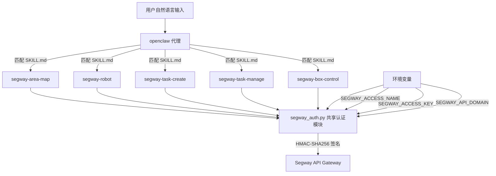
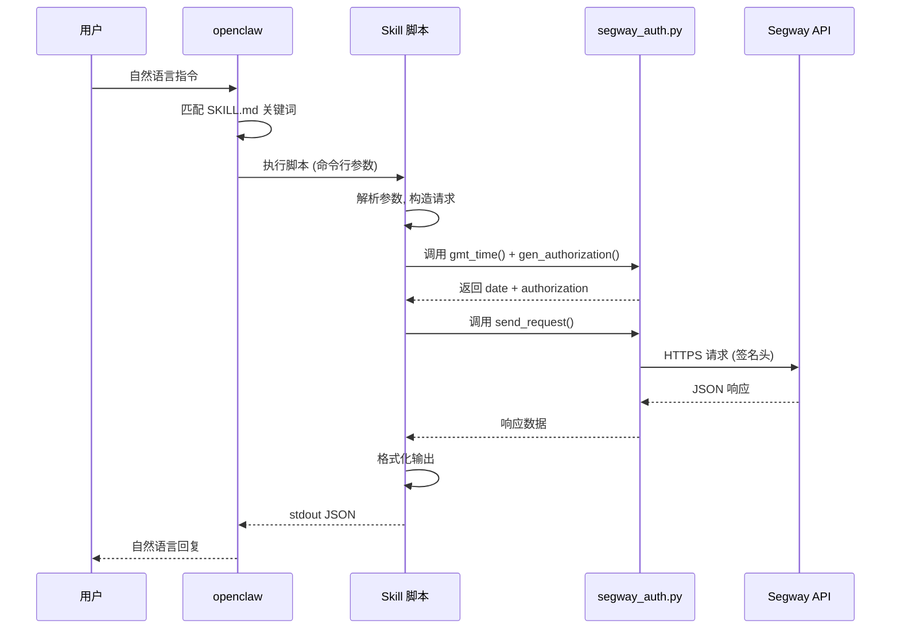

# 设计文档

## 概述

本设计将 Segway Robotics 配送机器人的云端 API 转化为 5 个功能内聚的 openclaw skills，每个 skill 包含 `SKILL.md` 描述文件和 Python 脚本。所有 skill 共享一个 HMAC-SHA256 认证模块 `segway_auth.py`，通过环境变量管理凭据，通过命令行参数接收操作类型和参数。

整体架构遵循"共享认证 + 独立 skill"的模式：认证模块负责签名生成和 HTTP 请求发送，各 skill 脚本负责参数解析、请求构造和响应格式化输出。openclaw 通过 SKILL.md 中的中文关键词描述匹配用户自然语言意图，调用对应脚本完成 API 操作。

## 架构

### 整体架构图



### 目录结构

```
/root/.openclaw/workspace/skills/
├── segway_auth.py                    # 共享认证模块
├── segway-area-map/
│   ├── SKILL.md                      # 楼宇与地图查询 skill 描述
│   └── scripts/
│       └── area_map.py               # 楼宇/站点/运力/地图查询脚本
├── segway-robot/
│   ├── SKILL.md                      # 机器人信息查询 skill 描述
│   └── scripts/
│       └── robot.py                  # 机器人列表/状态/位置/订单查询脚本
├── segway-task-create/
│   ├── SKILL.md                      # 运单创建 skill 描述
│   └── scripts/
│       └── task_create.py            # 引领/特殊引领/取送运单创建脚本
├── segway-task-manage/
│   ├── SKILL.md                      # 运单管理 skill 描述
│   └── scripts/
│       └── task_manage.py            # 取消/优先级/状态/历史/重配送脚本
└── segway-box-control/
    ├── SKILL.md                      # 箱门控制 skill 描述
    └── scripts/
        └── box_control.py            # 开箱/关箱/箱门信息/取物/取出脚本
```

### 调用流程



## 组件与接口

### 1. 共享认证模块 (`segway_auth.py`)

位于 `/root/.openclaw/workspace/skills/segway_auth.py`，供所有 skill 脚本通过 `sys.path` 导入。

#### 函数接口

| 函数 | 参数 | 返回值 | 说明 |
|------|------|--------|------|
| `gmt_time()` | 无 | `str` | 生成 `%a, %d %b %Y %H:%M:%S %Z` 格式的 GMT 时间字符串 |
| `gen_authorization(access_name, access_key, date, url, method)` | `str, str, str, str, str` | `str` | 生成 `SEGWAY {name}:{signature}` 格式的 Authorization 头 |
| `send_request(method, url, date, authorization, body=None)` | `str, str, str, str, dict/None` | `dict` | 发送 HTTP 请求，返回 JSON 响应 |
| `get_config()` | 无 | `tuple(str, str, str)` | 读取环境变量，返回 `(access_name, access_key, domain)` |
| `call_api(method, path, body=None, query_params=None)` | `str, str, dict/None, dict/None` | `dict` | 高层封装：自动完成签名 + 请求 + 返回响应 |

